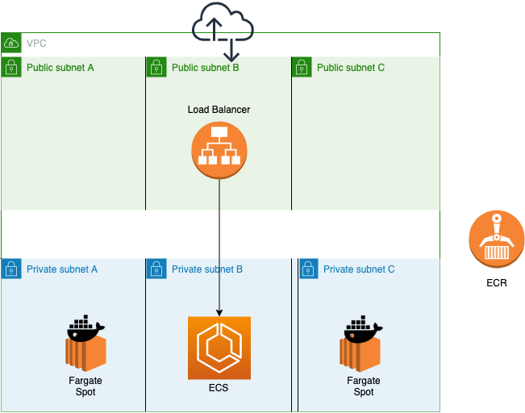
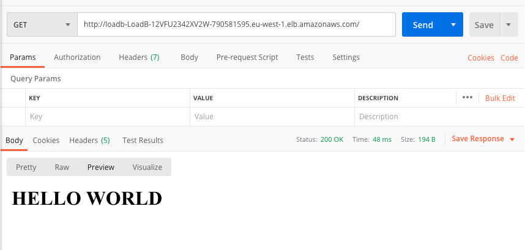

# [T3chFlicks](https://t3chflicks.org): AWS Auto Scaling Spot Fleet Cluster Quickstart
> Quickstart for running an example Service on AWS in an Auto Scaling Fargate Cluster

### Read The Blog Post ([github](./blog_post.md)/[medium](https://medium.com/@t3chflicks/cheaper-than-api-gateway-alb-with-lambda-using-cloudformation-b32b126bbddc)).

---

### Architecture

> 

### Example Usage
> 

### Step By Step Deployment
1. Deploy VPC
    * `aws cloudformation create-stack --stack-name vpc --template-body file://aws/00_vpc.yml --capabilities CAPABILITY_NAMED_IAM`
    * tutorial for VPC can be found [here](https://medium.com/@t3chflicks/virtual-private-cloud-on-aws-quickstart-with-cloudformation-4583109b2433)
1. Deploy Load Balancer
    * `aws cloudformation create-stack --stack-name loadbalancer --template-body file://aws/01_load_balancer.yml --capabilities CAPABILITY_NAMED_IAM`
1. Deploy Cluster
    * `aws cloudformation create-stack --stack-name cluster --template-body file://aws/02_ecs.yml --capabilities CAPABILITY_NAMED_IAM`
    * Upload Docker image of Web Sever to ECR 
      1. `docker build -t your_repo_name .`
      1. `docker tag your_repo_name your_repo_name_tag`
      1. `docker push your_repo_name`
1. Deploy Service
    * Update template with your Docker image
    * `aws cloudformation create-stack --stack-name service --template-body file://aws/03_service.yml --capabilities CAPABILITY_NAMED_IAM`

---

This project was created by [T3chFlicks](https://t3chflicks.org) - A tech focused education and services company.

---